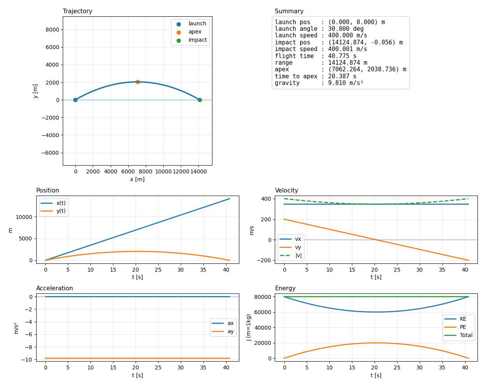
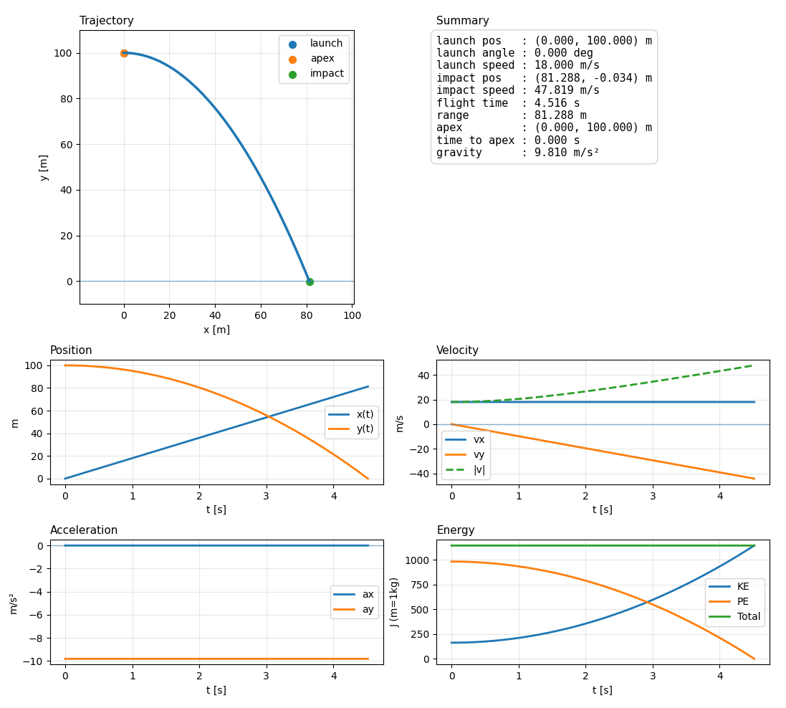

# Ballistics Lab

Simple ballistic scenario simulation CLI tool, outputs matplotlib plots with simulated trajectory and discrete solutions. Includes modular solvers and drag models with vacuum being available while linear or other models will be added in the future.

---

**Examples:**

```bash
# Artillery example
python -m ballistics_lab.main --x0 0 --y0 0 --speed 400 --angle 30

# UAV Payload example
python -m ballistics_lab.main --x0 0 --y0 100 --speed 18 --angle 0
```





---

**CLI Args:**

- launch parameters
 * `--x0`
   Initial horizontal position (meters)
   default: `0.0`
 * `--y0`
   Initial vertical position (meters)
   default: `0.0`
 * `--speed` **(required)**
   Launch speed (m/s)
 * `--angle`
   Launch angle (degrees)
   if omitted solver will compute it when targeting
 * `--gravity`
   Gravity acceleration (m/s^2)
   default: `9.81`

- targeting (optional)
 * `--target-x`
   Target horizontal position (meters)
 * `--target-y`
   Target vertical position (meters)
   default: `0.0`
 * `--arc`
   Which solution to use when 2 exist
   * `low` -> flatter, faster
   * `high` -> steeper, longer
     default: `low`

- simulation control
 * `--tmax`
   Max simulation time (seconds)
   default: `120.0`
 * `--dt`
   Time step (seconds)
   default: `0.001`
